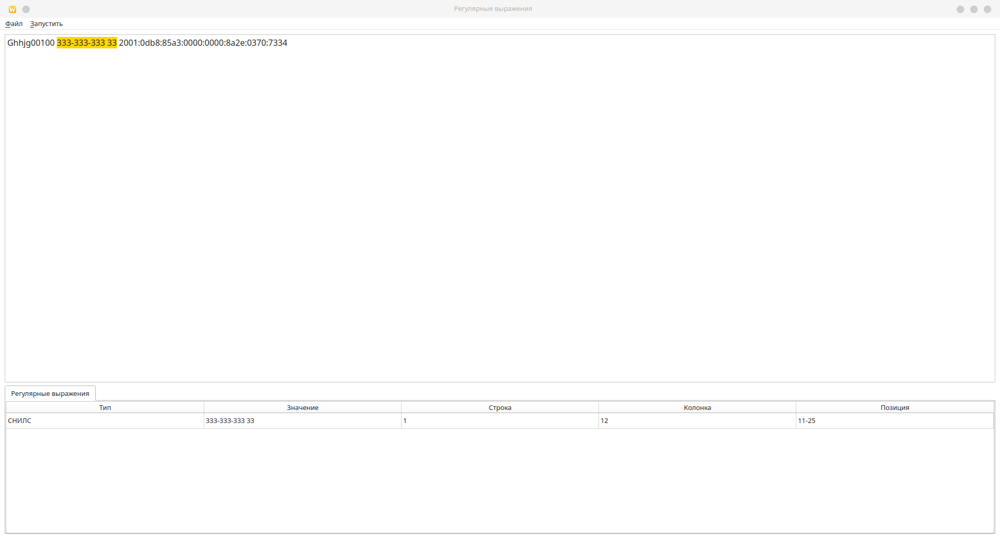

<b>Тема лабораторной работы:</b> Реализация алгоритма поиска подстрок с помощью регулярных выражений.

<b>Цель работы:</b> Реализовать алгоритм поиска в тексте подстрок, соответствующих заданным регулярным выражениям.

 

<b>1 Блок: Задача 26.</b> Построить РВ, описывающее СНИЛС.

<b>Решение:</b>

\b\d{3}-\d{3}-\d{3} \d{2}\b

<b>2 Блок: Задача 3.</b> Построить РВ, описывающее имя пользователя (набор букв и цифр длиной 3-20 символов, первым символом должна быть буква)

<b>Решение:</b>

\b([A-Za-z][A-Za-z0-9]{2,19}\b

<b>3 Блок: Задача 3.</b> Построить РВ, описывающее IP-адрес (v6).

<b>Решение:</b>

r'\b('
r'([0-9a-fA-F]{1,4}:){7}[0-9a-fA-F]{1,4}|'
r'([0-9a-fA-F]{1,4}:){1,7}:|'
r'([0-9a-fA-F]{1,4}:){1,6}:[0-9a-fA-F]{1,4}|'
r'([0-9a-fA-F]{1,4}:){1,5}(:[0-9a-fA-F]{1,4}){1,2}|'
r'([0-9a-fA-F]{1,4}:){1,4}(:[0-9a-fA-F]{1,4}){1,3}|'
r'([0-9a-fA-F]{1,4}:){1,3}(:[0-9a-fA-F]{1,4}){1,4}|'
r'([0-9a-fA-F]{1,4}:){1,2}(:[0-9a-fA-F]{1,4}){1,5}|'
r'[0-9a-fA-F]{1,4}:((:[0-9a-fA-F]{1,4}){1,6})|'
r':((:[0-9a-fA-F]{1,4}){1,7}|:)|'
r'fe80:(:[0-9a-fA-F]{0,4}){0,4}%[0-9a-zA-Z]{1,}|'
r'::(ffff(:0{1,4}){0,1}:){0,1}'
r'(([0-9a-fA-F]{1,4}:){1,4}:)'
r'((25[0-5]|2[0-4][0-9]|[01]?[0-9][0-9]?)\.){3}'
r'(25[0-5]|2[0-4][0-9]|[01]?[0-9][0-9]?)'
r')\b'

<b>Тестовые примеры:</b>
Поиск СНИЛС:

Поиск Имени пользователя:

Поиск IP-адреса:

